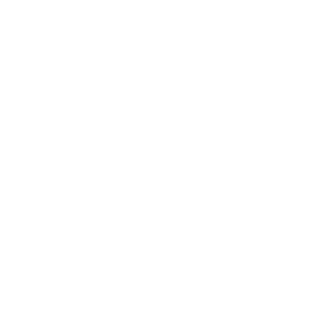

```{r setup-knitr, include=FALSE}
options(htmltools.dir.version = FALSE)
# knitr::opts_knit$set(root.dir='..')
knitr::opts_chunk$set(eval = TRUE, 
                      echo = FALSE, 
                      cache = FALSE,
                      include = TRUE,
                      collapse = FALSE,
                      message=FALSE,
                      warning=FALSE, 
                      dependson = NULL,
                      engine = "R", # Chunks will always have R code, unless noted
                      error = TRUE,
                      fig.path="Figures/",  # Set the figure options
                      fig.align = "center", 
                      #fig.width = 7,
                      #fig.height = 7, 
                      fig.keep='all', fig.retina=3)

library(RefManageR)
BibOptions(check.entries = FALSE,
           bib.style = "numeric",
           cite.style = "authoryear",
           # max.names = 1, 
           style = "markdown",
           hyperlink = FALSE,
           dashed = FALSE)
mybib <- ReadBib("references.bib", check=FALSE)

```


```{r setup-library}
library(tidyverse)
library(MASS)
library(reshape2)
library(plyr)
library(tidyverse)
library(lubridate)
library(readxl)
library(tidyselect)
library(tidystats)
library(glue)
library(here)
library(gt)
library(gtsummary)
library(kableExtra)

```


# `r emo::ji("wave")` Hello

### me: **Boncho Ku**

- **Statistician**, _Korea Institute of Oriental Medicine_
    + github: **@zorba78**
    + email: **secondmoon@kiom.re.kr**

- **Team**: Clinical Research Coordinating Team    


### Current Works in KIOM

.pull-left[
#### **Data Science**
- Statistical learning model
- Text mining
- Data linkage/statistical matching
- Data management
]


.pull-right[
#### **Biostatistics**
- Experiment & study design: RCT and observational study 
- Sample size calculation
- Statistical consulting
]


and providing several lectures related to R programming and statistics


#### Slides: **https://zorba78.github.io/talk-gallery**

---

# `r icons::fontawesome("clipboard-list", style="solid")` Outline


## `r icons::fontawesome("list-ol", style="solid")`  **Table of Contents**

<br>

> ### 1. Small talks about Statistics
>
> ### 2. Minimally Clinically Important Change (MCID)
>
> ### 3. Discussion


---

class: inverse, center, middle

# `r icons::fontawesome("search", style = "solid")` Small talks about Statistics 


---

#  History of "_statistical significance_"

### `r icons::fontawesome("long-arrow-alt-down", style="solid")` Flows

> - Edgeworth firstly mentioned `r AutoCite(mybib, "Edgeworth-1885")`
>
> - Sir Ronard A. Fisher described "_the test of significance_" in his book <**_Statistical Methods for Research Workers_**>
>
> - Original intention
>     - **FY. Edgeworth**: mentioned as a tool to indicate when a result needs further scrutiny
>     - **RA. Fisher**: intended to blend data and background knowledge to lead to scientific conclusions


In the 19<sup>th</sup> century $\rightarrow$ **the obtained value shows something meaningful**


In the 20<sup>th</sup> century $\rightarrow$ "**_very important_**"


---

#  History of "_statistical significance_"


### `r icons::fontawesome("long-arrow-alt-down", style="solid")` Flows (_continued_)

> - Evidence-based decision making movement
>
> - Lead by the most influential statisticians (**Jerzy Neyman** and **Egon Pearson**)
>
> - Neyman & Pearson introduced: 
>   - Statistical power, false positive, false negative and so many important concepts related to statistics
>   - Intendedly left out the **_P-value_**

---


# `r icons::fontawesome("asterisk", style = "solid")` Argue in the Statistical Significance 

## The Origin 

> **A fierce debate between the most famous statisticians in the history of statistics**

--

.pull-left[
 &nbsp;&nbsp;&nbsp;&nbsp;&nbsp;&nbsp; 
] 
.pull-right[
 
]
.pull-left[
Sir. Ronald A. Fisher<br>&nbsp;&nbsp;&nbsp;&nbsp;(1890 ~ 1962)
]
.pull-right[
&nbsp;&nbsp;&nbsp;&nbsp;Egon Pearson&nbsp;&nbsp;&nbsp;&nbsp;&nbsp;&nbsp;&nbsp;&nbsp;&nbsp;Jerzy Neyman<br>&nbsp;&nbsp;&nbsp;&nbsp;(1895 ~ 1980)&nbsp;&nbsp;&nbsp;&nbsp;&nbsp;&nbsp;&nbsp;&nbsp;&nbsp;&nbsp;&nbsp;(1894 ~ 1981)
]


???
Sir Ronald Aylmer Fisher

통계적 검정법은 K. Pearson과 W. Gosset의 경우를 제
외하고 나면 흔히‘유의성검정 (significance test)’이라고 불리는 Fisher의 검정법과‘가
설검정 (hypotheses test)’이라고 불리는 Neyman-Pearson의 검정법이 등장한 1920–
1930년대부터 시작된다.

1925년에는 Fisher의 책 Statistical Methods for Research Workers를 통해 유의성검정
(test of significance)이 처음 소개되었고 이어서 1928년과 1933년에 Neyman-Pearson
의 가설검정 (test of hypotheses) 연구가 나왔다


---

#  Motivation of Fisher

## `r icons::fontawesome("mug-hot", style="solid")` The Lady Tasting Tea

.pull-left[]
.pull-right[

### Is the lady possible to distinguish all sequences for making tea? 

### **The birth of Test of Significance**

]


<br>
<br>

--

## That is, a famous **Fisher's Exact Test**


???

통계학의 기틀이 다져지던 무렵 영국의 한 귀부인은 밀크홍차의 맛만 보고 우유와 차를 따른 순서를 구분할 수 있다고 주장하였다. 
이를 믿지 않았던 피셔는 귀무가설을 설정하고 이를 증명하는 실험을 준비한다. 
우유와 차를 다른 순서로 따른 홍차를 4개씩 준비하여 총 8개를 무작위의 순서로 귀부인에게 맛보게 한 뒤 답을 말하게 하였다. 
설계가 허망하게 귀부인은 차를 만든 순서를 모두 맞추었다. 
하지만 피셔는 ‘차 마시는 여인’의 문제를 통해 귀무가설과 무작위를 이용한 가설 검정기법을 제시한다

---


#  History of "_statistical significance_"

###  **The comparison between Two Appraches**

#### **RA. Fisher** $\rightarrow$ (_Inductive Inference_)

> - Set **only** the null hypothesis $H_{0}$
> - Derive a **p-value** from the data
> - If the obtained p-value is **sufficiently small**, then
data can be redarded as the statistically significant result


#### **Neyman and E. Pearson** $\rightarrow$ (_Inductive Behaviour_)

> - Set **both** null $(H_{0})$ and alternative $(H_{1})$
> - Select the **test statistics** and the **region of rejection** 
satisfying the maximum power under the given significance level $\alpha$
> - Obtain the **test statistics** from the given data
> - If an obtained test statistics fell into the region of rejection, 
then accept $H_{1}$; Otherwise accept $H_{0}$


###`r icons::fontawesome("long-arrow-alt-right", style="solid")` Today, **HYBRID** both paradigms


???

Fisher

H0 를 반증(disprove)할 수는 있으나 증명하거나 채택할 수는 없다.
검정의 결과는 임시적인 것으로서 다시 고칠 수 있어야한다.
검정통계량을 임의로 선택한다. 최
적검정법 (optimal test) 라는 보장이 없다.
유의한 결과가 나와도 H1 이 없으므로 구체적인 결론을 내릴 수 없
다. 유의한 결과가 나오지 않으면 결론은 더욱 모호하다.

P-Neyman
제품의 합격-불합격 판정을 할 때에나 쓸 수 있는 것으로서 일반적인 
과학 연구에서의 추론 방법으로적절하지 않다.
현실적인 과학실험에서는 동일한 검정을 반복해서 얻는 확률의 개념
이 타당하지 않다.

---


# The Statistical Inference Today

<br>

.center[]


.center[##### Schematic relationship between population, sample, statistic, and sampling distribution]


---

# Exact Meaning of the P-value

##  `r icons::fontawesome("info-circle", style = "solid")` Definition


> The probability, **under the assumption of the null hypothesis**, of 
obtaining a result equal to or more extreme than what was **actually observed**. 


### Interpretation

> $P = 0.5$ : Under the $H_{0}$, values greater or less than a statistic obtained from the given data is observed
about once in the two times $\rightarrow$ insufficient to reject $H_{0}$
>
> $P = 0.000001$ : Under the $H_{0}$, it is almost impossible to observe such values as extreme as the data given 
$\rightarrow$ sufficient to reject $H_{1}$


### How about 

> Assume an RCT to investigate the efficacy of the treatment drug and obtain the result of $P=0.108$. 
>
> What is your interpretation of the result?


???

우리가 얻은 데이터로부터 도출한 통계량만큼의 값을 귀무가설 하에서 관찰할 확률 

p=0.5 이면 두 번에 한번 꼴로 우리가 표본으로부터 획득한 통계량을 귀무가설 하의 분포에서 관찰할 수 있음
p=0.0000001 이면 매우 낮은 확률로 우리가 얻은 통계량이 귀무가설 하의 분포에서 관찰됨. 즉 거의 관찰되지 않음. 
귀무가설을 기각함. 


---

# `r icons::fontawesome("play-circle", style = "solid")` Playing with P-values

##  Simulation

### Scenario 1: $H_{0}$ is true


>- Suppose $X \sim \mathcal{N}(\mu_{X}, \sigma^{2}_{X})$ and $Y \sim \mathcal{N}(\mu_{Y}, \sigma^{2}_{Y})$
>
>- Assume that $\mu_{X}=\mu_{Y}=100$ and $\sigma_{X}=\sigma_{Y}=20$
>
>- Obtain the p-value from the independent two-sample t-test based on 100 samples independently extracted from the distribution of $X$ and $Y$. 
>
>- Experiment 100,000 times

---

# `r icons::fontawesome("play-circle", style = "solid")` Playing with P-values

### Scenario 1: Result


```{r p-val-sim1, echo=FALSE, fig.width=12, fig.height=8, out.width="70%", dev='svg', cache=T}

nsim <- 100000
p <- numeric(nsim)
set.seed(19780904)
for (i in 1:nsim) {
  x <- rnorm(n = 100, mean = 100, sd = 20)
  y <- rnorm(n = 100, mean = 100, sd = 20)
  p[i] <- t.test(x, y)$p.value
}

hist(p, main = "Histogram of p-values under the null hypothesis", 
     xlab = "Observed p-value", col = "#A66C00")
```


> - Even if no true difference b/w $X$ and $Y$ $\rightarrow$ `r round(sum(p<0.05)/length(p)*100, 1)` % of p-values $< 0.05$
> - Even if $X$ and $Y$ are identically distributed $\rightarrow$ `r round(sum(p>0.95)/length(p)*100, 1)` % $> 0.95$

---

# `r icons::fontawesome("play-circle", style = "solid")` Playing with P-values

##  Simulation

### Scenario 2: small difference between $X$ and $Y$


> - Suppose $X \sim \mathcal{N}(\mu_{X}, \sigma^{2}_{X})$ and $Y \sim \mathcal{N}(\mu_{Y}, \sigma^{2}_{Y})$
> 
> - $\mu_{X} = 100$, $\mu_{Y} = 102$ 
> 
> - $\sigma_{X}=\sigma_{Y}=20$
> 
> - Increasing sample size 30, 100, 200, 400, 1000 and obtaining P-values resulted from independent two sample t-tests
> 
> - Experiment 10,000 times


---


# `r icons::fontawesome("play-circle", style = "solid")` Playing with P-values

### Scenario 2: Result


```{r sim-02, eval=FALSE}

sample_n <- c(30, 100, 200, 400, 1000)
mu_x <- 100; mu_y <- 102
sigma_x <- sigma_y <- 20

dat <- expand.grid(n = sample_n, 
                   mu_x = mu_x, 
                   sigma_x = sigma_x, 
                   mu_y = mu_y, 
                   sigma_y = sigma_y)

sim_ttest <- function(mu_x, mu_y, sigma_x, sigma_y, rep, n) {
  p <- numeric(rep)
  for (i in 1:rep) {
    x <- rnorm(n = n, mean = mu_x, sd = sigma_x)
    y <- rnorm(n = n, mean = mu_y, sd = sigma_y)
    p[i] <- t.test(x, y)$p.value
  }
  return(p)
}

set.seed(19780904)
dat %>% 
  mutate(res = pmap(
    .l = list(mu_x = mu_x, 
              mu_y = mu_y, 
              sigma_x = sigma_x, 
              sigma_y = sigma_y, 
              rep = 100000, n = n), 
    .f = sim_ttest
    )) -> dat

dat %>% 
  mutate(p_less_sig = map_dbl(res, ~ sum(.x < 0.05)/100000)) -> dat
write_rds(dat, "data/simdat-02.rds")
```


```{r p-val-sim2, echo=FALSE, fig.width=12, fig.height=8, out.width="70%", dev='svg'}
dat <- read_rds("../data/simdat-02.rds")
sample_n <- c(30, 100, 200, 400, 1000)
barplot(dat$p_less_sig, names.arg = sample_n, 
        xlab = "Sample size", ylab = "Proportion", 
        cex.names = 1.3, cex.axis = 1.3, cex.lab = 1.5, 
        main = expression(paste("Proportion of p-values less than 0.05 for each sample size")), 
        cex.main = 2, 
        col = "#A66C00")

```

> Increasing sample size $\rightarrow$ % of $P < 0.05$ increase

---
# `r icons::fontawesome("play-circle", style = "solid")` Playing with P-values

##  Simulation

### Scenario 3: Large Effect Size 


> - Suppose $X \sim \mathcal{N}(\mu_{X}, \sigma^{2}_{X})$ and $Y \sim \mathcal{N}(\mu_{Y}, \sigma^{2}_{Y})$
> 
> - $\mu_{X} = 100$, $\mu_{Y} = 116$ 
> 
> - $\sigma_{X}=\sigma_{Y}=20$
>
> - True effect size $\delta=0.8$
>
> - Identical number of samples and experiments to the scenario 1 except for the sample size $n = 33$


---

# `r icons::fontawesome("play-circle", style = "solid")` Playing with P-values

### Scenario 3: Result


```{r p-val-sim3, echo=FALSE, fig.width=14, fig.height=8, out.width="75%", dev='svg', cache=T}
nsim <- 100000
p <- d <- numeric(nsim)
set.seed(19780904)
for (i in 1:nsim) {
  x <- rnorm(n = 33, mean = 100, sd = 20)
  y <- rnorm(n = 33, mean = 116, sd = 20)
  p[i] <- t.test(x, y)$p.value
  d[i] <- diff(t.test(x, y)$estimate)
}

par(mfrow = c(1, 2))
hist(d, main = "Histogram of Effect Size", 
     xlab = expression(delta), col = "#A66C00")
abline(v = mean(d), col = "red")

hist(p, breaks = 100, main = "Histogram of p-values under the null hypothesis", 
     xlab = "Observed p-value", col = "#A66C00")


```


> - Effect size $\delta$ converged to the true difference 16
> - % of $P < 0.05$ = `r round(sum(p<0.05)/nsim*100, 1)` $\approx$ 90 % $\rightarrow$ **statistical POWER**


---
# `r icons::fontawesome("clipboard-check", style = "solid")`  Guidlines 

###  ASA's statement on p-values `r AutoCite(mybib, "Wasserstein-2016")`

> 1. indicating **incompatible the data are with a specified statistical model**. 
>
> 2. **NOT MEASURE THE PROBABILITY**: the studied hypothesis is **true**, the data were produced by
random chance alone.
>
> 3. **DO NOT MAKE CONCLUSIONS**: based only on whether a p-value passes a specific threshold 
$\rightarrow$ don't use $p < 0.05$ and **\*\***, something like that
>
> 4. **Do full reporting and transparency**
>
> 5. **NOT MEASURE** the size of an effect or the importance of a result
>
> 6. **NOT ** a good measure of **EVIDENCE**


???

1. 유의성만 보고
2. 모수에 대한 확률이 아님
3. 높은 P값이 귀무가설이 옳다는 증거로 사용되는 오류
   - 증거의 불충분함을 의미함  
   - 귀무가설의 옳고그름을 증명하는 것은 불가능 
   H0: 두 집단 간 평균 차이가 없다면 효과가 없다 
   H1: 두 집단 간 평균 차이가 있다면 효과가 있다
   
귀무가설에 대한 대우명제는 효과가 없다면 두 집단 간 평균 차이가 있다임

4. 낮은 P-값이 항상 의미가 있다고 이해하는 오류
5. 신뢰구간을 무시

1. P-values can indicate how incompatible the data are with a
specified statistical model.
2. P-values do not measure the probability that the studied
hypothesis is true, or the probability that the data were produced by
random chance alone.
3. Scientific conclusions and business or policy decisions should not be
based only on whether a p-value passes a specific threshold.
4. Proper inference requires full reporting and transparency.
5. A p-value, or statistical significance, does not measure the size of
an effect or the importance of a result.
6. By itself, a p-value does not provide a good measure of
evidence regarding a model or hypothesis.


---

class: inverse, center, middle

# `r icons::fontawesome("smile", style = "solid")``r icons::fontawesome("arrows-alt-h", style = "solid")``r icons::fontawesome("frown", style = "solid")` Minimally Clinically Important Difference 


---

# `r icons::fontawesome("info-circle", style = "solid")` Definition 

### In Origin (MCID)

> **"_The smallest difference in score in the domain of interest which patients perceive as 
beneficial and which would mandate, in the absence of troublesome side effects and 
excessive cost, a change in the patient's management_"**
>  _`r AutoCite(mybib, "jaeschke-1989")`_


### Focusing on Patients: Minimal Imporant Change (MID)

> **"__the smallest difference in score in the outcome of interest that informed patients or
informed proxies perceive as important, either beneficial or harmful, and that would
lead the patient or clinician to consider a change in the management__"**
> _`r AutoCite(mybib, "schunemann-2005b")`_


### In Simple

> **"_the smallest (minimal amount of) change that is important to patients_"**
> _`r AutoCite(mybib, "copay-2007", .opt = list(max.names = 2))`_


???

환자 중심의 진료(patient-centered care)가 강조되면서 환자의 주관적 삶의 질 또는 경험
이 점차 중요해졌고, 이에 따라 다양한 연구에서 각종 HRQoL 또는 PRO 도구가 중요한 측정
도구로 활용되고 있다(Wyrwich, 2004; Wyrwich et al., 2013). 그러나 PRO는 훈련받은 임상
전문가가 아닌 환자의 평가를 통해 산출되기 때문에, 이에 대한 해석의 어려움이 따른다. 
즉, PRO 도구로 측정된 점수 변화가 과연 의미 있는 변화인지 또는 환자 관리를 다른 방식으로
변경해야 할 정도의 변화인지 등을 판단하기가 쉽지 않다. 통계적 유의성을 근거로 판단하는
방법도 있으나, 통계적 유의성은 표본 크기에 따라 작은 차이에도 유의하게 나오거나 큰 차
이에도 유의하지 않게 나올 수 있다. 따라서 통계적 유의성만으로 임상적 유의성을 판단하는
데에는 한계가 있다. 이에 대한 대안으로 환자에게 중요한 PRO 변화가 어느 수준인지 파악
하기 위한 체계적 시도가 이뤄졌는데, 특히 캐나다 McMaster 대학교 연구진들을 중심으로
관련 연구가 활발하게 수행되었다. 이 연구진들은‘최소한의 임상적으로 의미 있는 차
이’(minimal clinically important difference, MCID)에 대한 기준을 제공하고자 노력하였는데,
Jaeschke et al. (1989)은 MCID를 다음과 같이 공식적으로 정의하였다.

 이 정의에 따르면 MCID는 환자가 이익(beneficial)으로 인식하고, (번거로운 부작용이나 과
도한 비용이 발생하지 않아도) 환자 관리에 변화가 필요할 수 있는 관심 영역에서의 가장 작
은 점수 차이를 의미한다. 그러나 ‘임상적(clinical)’이란 용어가 환자 일상 경험보다는 임
상 영역(clinical arena)에 더 초점을 맞추는 경향이 있다는 주장이 제기되어(Schünemann et
al., 2005a), 이후 같은 연구팀에서는 ‘임상적’이라는 용어를 제외한 ‘최소한의 의미 있는
차이’(minimal important difference, MID)를 사용하기 시작했다(Juniper et al., 1994;
Schünemann et al., 2005b). Schünemann et al.(2005b)은 MID를 다음과 같이 공식적으로 재정
의하였다. 

즉, MID는 환자(informed patients) 또는 대리자(informed proxies)가 중요하다고, 즉 이익
이(beneficial) 되거나 해롭다고(harmful) 인식하고, 환자나 임상의가 관리에 변화를 고려하도
록 만들 수 있는 관심 결과(outcome of interest)에서의 가장 작은 점수 차이를 의미한다. 이
외에도 감지할 수 있는 최소 변화(minimum detectable change, MDC), 감지할 수 있는 가장
작은 차이(smallest detectable difference) 등 다양한 용어가 혼합되어 사용되고 있다. 여기서
는 호주 PBAC 지침에서와 마찬가지로 MCID라는 용어로 통칭하여 사용하였으며, 용어에 대
한 정의 및 변천사는 King et al.(2011) 등의 다른 연구를 참조할 수 있다. 


---

# How to Obtain M(C)ID? 

<br>

## 1. **Anchor-based methods**

<br><br>

## 2. **Distribution-based methods**


<br><br>

## 3. Delphi method (_skip_)


<br><br>


???

그 외 도구정의 접근법
누적분포법 -> 도구점수의 변화를 X축으로 해서 이 점수 변화를 cut-off 사용 시 responder 비율을 Y에 제시

---

# `r icons::fontawesome("anchor", style = "solid")` Anchor-based Methods 

### **Compare new PROs to the Well-Known PRO**

> - Use an external criterion to define an important change 
> - Compare PRO scores to the patient's answers to another subjective instrument
> - typical Anchors: 
>    - Global Rating of Change
>    - Global Perceived Effect
>    - Patients' Global Impression of Change
>    - SF-36, ...
> - Concerning PRO scores must show the correlation to the anchor. 


### **Disadvantages**

> - **Lack of validity and reliability**
> - **Too subjective**
> - **Recall bias**


`r icons::fontawesome("long-arrow-alt-right", style = "solid")` **_VERY SENSITIVE TO CHANGE IN BOTH NEG. AND POS._**


???

준거기반법. 준거(anchor)가 될 수 있는 다른 측정도구를 이용해 MID 추정 방법
Anchor는 MID를 추정하고자 하는 측정도구와 상관관계를 보여야만 Anchor로 사용 가능 


준거기반법의 주요 한계점으로는 (1) 회상에 기반한 준거 이용 시 회상 비뚤림(recall bias)
이 발생할 수 있고, (2) 어떤 준거 도구를 사용했느냐에 따라 결과가 달라질 수 있으며, (3)
표준화가 상대적으로 어렵고, (4) 준거 도구를 함께 적용 시 응답 과정에서 일치화
(concordance)가 발생할 수 있는 점 등이 있다


---

# `r icons::fontawesome("anchor", style = "solid")` Anchor-based Methods 


### **Regression Approach**

> - $\mathrm{y}$: $n \times 1$ response vector representing the change in PRO score 
> - $\mathrm{X}$: $n\times k$ matrix representing the **anchor** as continuous or dummy variable (dichotomized, or categorized)
> - $\mathrm{Z}$: $n\times l$ matrix representing covariates (e.g. age, sex, education level, ...) 
> - linear regression model $\rightarrow$ OLS or GLM to estimate the regression coefficients

$$\mathrm{y} = \mathrm{X}_{n\times k}\beta_{k\times 1} + \mathrm{Z}_{n\times l}\gamma_{l \times 1} + \epsilon$$
> - $\beta_{k\times 1}$: the regression coefficients for anchor score
> - $\gamma_{l\times 1}$: the regression coefficients for covariates

#### **MCID**: the estimated regression coefficient $\hat{\beta}$


> - Transform $\mathrm{X}$ to the dummy variable with two categories $\rightarrow$ identical to the **between patients score change**
> - Can be adjustable for covariates 


???

X와 Y를 반대로 놓고 로지스틱 회귀모형 사용 가능 이경우 ROC 방법과 유사

---


# `r icons::fontawesome("anchor", style = "solid")` Anchor-based Methods 


### **Mean Change Appraoch**

> - A subgroup of patients who reported themselves to an anchor's specific score (e.g. better, or improved)
> - calculate the mean change and its $(100-\alpha)\%$ confidence interval
> - Let $\bar{\delta}$ and $s_{\delta}$ be the mean change and its standard deviation of the subgroup, 

$$\bar{\delta} \pm z_{1-\alpha}\frac{s_{\delta}}{\sqrt{n}}$$ 
#### **MCID**: $\bar{\delta}$ $\rightarrow$ mean change in the subgroup


.center[]


---

# `r icons::fontawesome("anchor", style = "solid")` Anchor-based Methods 


### **Minimum Detectable Change (MDC) Approach**

> - Smallest change considered to be above the measurement error with a given confidence level
> - Use of the mean change in score in non-responders categorized by the anchor
> - Let $\bar{\delta}_{nr}$ and $s_{\delta_{nr}}$ be the mean change and standard deviation in the non-responder group, $\alpha$ : type I error

$$\bar{\delta}_{nr} \pm z_{1-\alpha}\frac{s_{\delta_{nr}}}{\sqrt{n}}$$

#### **MCID**: $\bar{\delta}_{nr} + z_{1-\alpha}s_{\delta_{nr}}(\sqrt{n})^{-1}$ $\rightarrow$ upper limit of $(1-\alpha)\%$ CI


.center[]


---

# `r icons::fontawesome("anchor", style = "solid")` Anchor-based Methods 


### **Between Patients Score Change Approach**

> - The mean difference or mean change difference between groups with responder and non-responder of the anchor
> - Let $\bar{\Delta}_{r}$ and $\bar{\Delta}_{nr}$ be the mean change in the responder and non-responder group


**MCID**: $\bar{\Delta}_{r} - \bar{\Delta}_{nr}$ $\rightarrow$ the group difference


.pull-left[]
.pull-right[
Note that when obtaining the pooled variance of $\Delta_{r}$ and $\Delta_{nr}$ , $s_{pooled}$

$$Effect~Size = \frac{\bar{\Delta}_{r} - \bar{\Delta}_{nr}}{s_{pooled}}$$

$s_{pooled} = \sqrt{\frac{(n_{1} -1)s^{2}_{\Delta_{r}} + (n_{2}-1)s^{2}_{\Delta_{nr}}}{n_{1} + n_{2} - 2}}$


$\rightarrow$ can be used to **sample size calculation**

]

---

# `r icons::fontawesome("anchor", style = "solid")` Anchor-based Methods 


### **ROC curves Approach**

> - $Y\in\{0, 1\}$ : anchor scores splitted into two categories
>    - $Y = 1$ : clinically meaningful; $Y = 0$ : otherwise
> - $X = [X_{1}, X_{0}]^T$ : diagnostic measurement that fall into $Y_{1}$ and $Y_{0}$, respectively $(X \in \mathcal{R}^1)$ 
> - The $2\times 2$ table of a dichotomous test

```{r}
require(kableExtra)
tab <- tibble(`Diagnositc measurement` = c("\\(X_{1}\\)", "\\(X_{0}\\)", "Total"), 
              `\\(Y_{1}\\)` = c("TP", "FN", "\\(n_{1}\\)"), 
              `\\(Y_{0}\\)` = c("FP", "TN", "\\(n_{0}\\)"), 
              Total = c("\\(m_{1}\\)", "\\(m_{0}\\)", "N"))
tab %>% 
  kbl(booktabs = TRUE, 
      escape = TRUE, align = "lccc") %>% 
  kable_classic(full_width = FALSE) %>% 
  add_header_above(c(" ", "Anchor" = 2, " ")) %>% 
  footnote(general = "TP: true positive; TN: true negative; FP: false positive; FN: false negative")
  # kable_styling(full_width = FALSE)
  
```

---

# `r icons::fontawesome("anchor", style = "solid")` Anchor-based Methods 


### **ROC curves Approach**

> - ROC: Receiver Operating Charcteristic 
> - $\mathrm{Sensitivity} = P(X_{1}|Y_{1}) = \frac{TP}{TP + FN} = \frac{TP}{n_{1}}$ $\rightarrow$ True positive rate (TPR)
> - $\mathrm{Specificity} = P(X_{0}|Y_{0}) = \frac{TN}{TN + FP} = \frac{TN}{n_{0}}$ $\rightarrow$ True negative rate (TNR)
> - False positive rate (FPR) = 1 - Specificity
> - Considering all possible thresholds $c$, ROC curve can be defined as a function of $c$

$$\mathrm{ROC}(\cdot) = \{\mathrm{FPR}(c), \mathrm{TPR}(c), c \in (-\infty, +\infty) \}$$
where


$$\begin{aligned}\mathrm{TPR}(c) &= P(X > c|Y_{1}) \\ \mathrm{FPR}(c) &=P(X>c|Y_0)\end{aligned}$$


#### **MCID**: $\max_{c}\left\{ P(Y = 1, X\geq c)/P(X\geq c) + P(Y = 0, X\leq c)/P(X\leq c)  \right\}$

> - maximizing the sum of sensitivity and specificiy $\rightarrow$ **Youden index**
> - Calculate the area under the ROC curve (AUROC) $\rightarrow$ general performance (classification) of $X$

---

# `r icons::fontawesome("anchor", style = "solid")` Anchor-based Methods 


### **ROC curves Approach**


```{r roc-example, fig.width=12, fig.height=8, out.width="80%"}
pacman::p_load(ggthemes, ggpubr, gganimate, magick)

combine_gifs <- function(plot1, plot2) {
    require(magick) 
    # read the plots and store them
    plot1 <- image_read(plot1) 
    plot2 <- image_read(plot2) 
    # sync the number of frames in each plot
    n1 = length(plot1)
    n2 = length(plot2)
    # match number of frames of the two plots
    if (!(n1 == n2)) plot1 <- rep(plot1, n2) 
    if (!(n1 == n2)) plot2 <- rep(plot2, n1)
    # initialize the combined plot
    p <- image_append(c(plot1[1], plot2[1]))
    # grow the combined plot frame by frame
    n = ifelse(n1 == n2, n1, n1 * n2) 
    n = min(1000, n)  # set max to 1000
    for (i in 2:(n-1)) {
        tmp <- image_append(c(plot1[i], plot2[i]))
        p <- c(p, tmp)
    }
    return(p) 
}

s_mean <- 2  # signal mean
s_sd <- 1.1   # signal standard deviation
x <- seq(-5,5,by=0.01) # range of signal
signal <- rnorm(100000,s_mean,s_sd)
noise <- rnorm(100000,0,1)
PX_n <- 1 - pnorm(x, mean = 0, sd = 1) # P(X > c | noise only) = False alarm rate
PX_sn <- 1 - pnorm(x, mean = s_mean, sd = s_sd) # P(X > c | signal plus noise) = Hit rate


threshold <- data.frame(val = seq(from = .5, to = s_mean, by = .2))
dist <- 
  data.frame(Improved = signal, `Not improved` = noise) %>% 
  gather(data, value) %>% 
  ggplot(aes(x = value, fill = data)) +
  geom_density(trim = TRUE, alpha = .5) +
  ggtitle("PRO score") +
  xlab("observed signal")  + 
  scale_fill_manual(values = c("blue", "pink"))
p1 <- dist + geom_vline(data = threshold, 
                        xintercept = threshold$val, color = "red") +
            transition_manual(threshold$val) + 
  theme_classic(base_size = 15)
p1 <- animate(p1)

df2 <- data.frame(x, PX_n, PX_sn)
roc <- ggplot(df2) +
  xlab("1 - Specificity") + ylab("Sensitivity") +
  geom_line(aes(PX_n, PX_sn)) +
  geom_abline(slope = 1) +
  ggtitle("ROC Curve") + 
  coord_equal()
q1 <- roc +
        geom_point(data = threshold, aes(1-pnorm(val),
                          1- pnorm(val, mean = s_mean, sd = s_sd)), 
                          color = "red") +
                          transition_manual(val) + 
  theme_classic(base_size = 15)
q1 <- animate(q1)

combine_gifs(p1,q1)

```

.center[##### Epitomized from https://www.r-bloggers.com/2019/01/roc-curves/]


> - Considering multiple covariates, **binary logistic regression** is useful


---

#  Distribution-based Methods 

### Based on statistical distribution

> - Commonly use the change of scores and its variability
> - Explain the change beyond some level of random variation
> - Easily appliable when absence of the anchor to interpret the change of PRO scores
> - Distictly different from the MCID
> - Sample-specific


### In Regulatory 

> - Pharmaceutical Benefits Advisory Committee (PBAC): favor of the anchor-based approach
> - Food and Drug Administration: distribution-based approach roles to support the anchor-based approach

---
#  Distribution-based Methods 

### ** $0.5 \times \mathrm{SD}$ **

> - When the distribution are approximately normal, $0.5\times SD$ is closed to the effect size of 0.5
> - **MCID**: $0.5\times SD$ of changes in the instrument

### **Standard Error of Measurement (SEM)**

> - The variation in the score due to the un reliability of the scale or measure used
> - Sample indepdendent
> - Express the original metric of the instrument
> - SEM is defined with the given reliability of the instrument, $r_{xx}$

$$\mathrm{SEM} = SD_{\mathrm{baseline}} \sqrt{1 - r_{xx}}$$


$r_{xx}$ can be Cronbach's $\alpha$ or intraclass correlation coefficient (ICC)

#### **MCID**: $1\times \mathrm{SEM}$ $\rightarrow$ closely related to PROs measured by the anchor-based approach


---

#  Distribution-based Methods 

### **Reliable Change Index (RCI)**

> - Evaluate whether a change over time of an individual score is considered statistically significant. 
> - Let the change from baseline be $\delta$, 

$$\mathrm{RCI} = \frac{\delta}{SE_{\delta}} = \frac{\delta}{\sqrt{1.96\times SEM}}$$ 
 > Closely related to the MDC. 
 > $\mathrm{RCI} > 1.96$ considered to be statistically significant 
 
 
 **MCID**: $1.96 \times SD_{b}\sqrt{2(1 - r_{xx})}$, $SD_{b}$ : SD of the baseline 


### **Effect Size**

$$ES = \frac{x_{2} - x_{1}}{SD_{b}}$$

> Following Cohen's Criteria 


**MCID**: $c\times SD_{b}$ . $c$ can be 0.2, 0.5, 0.8. 


---

class: inverse, center, middle

#  Discussion

---

# `r icons::fontawesome("dumbbell", style = "solid")` Strengths of MCID

<br>

### 1. Threshold to detect the change beyond random errors 

### 2. Patient's based perspective $\rightarrow$ guiding clinical decision making

### 3. The evidence to determine sample size calculations 


---

#  Weakness of MCID


### 1. NOT a universal fixed attribute 

> - difficult to transfer across populations, disease-specifit states


### 2. TOO MANY methodologies to estimate MCIDs. 

> - Dependant on the methodology chosen


### 3. Absence of a single, universally accepted MCID value


### 4. Not taking account into the cost of the treatment


---
class: inverse, center, middle

# Thank you for patients!!


--
<br><br>
# Question??


---

# References

```{r refs, echo=FALSE, results="asis"}
PrintBibliography(mybib)
```


