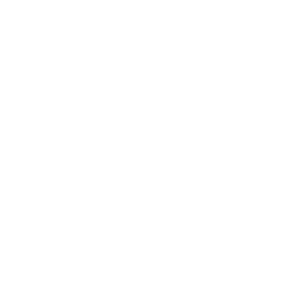

```{r setup-knitr, include=FALSE}
options(htmltools.dir.version = FALSE)
# knitr::opts_knit$set(root.dir='..')
knitr::opts_chunk$set(eval = TRUE, 
                      echo = FALSE, 
                      cache = FALSE,
                      include = TRUE,
                      collapse = FALSE,
                      message=FALSE,
                      warning=FALSE, 
                      dependson = NULL,
                      engine = "R", # Chunks will always have R code, unless noted
                      error = TRUE,
                      fig.path="Figures/",  # Set the figure options
                      fig.align = "center", 
                      #fig.width = 7,
                      #fig.height = 7, 
                      fig.keep='all', fig.retina=3)

library(RefManageR)
BibOptions(check.entries = FALSE,
           bib.style = "numeric",
           cite.style = "authoryear",
           style = "markdown",
           hyperlink = FALSE,
           dashed = FALSE)
mybib <- ReadBib("references.bib", check=FALSE)

```


```{r setup-library}
library(tidyverse)
library(MASS)
library(reshape2)
library(plyr)
library(tidyverse)
library(lubridate)
library(readxl)
library(tidyselect)
library(tidystats)
library(glue)
library(here)
library(gt)
library(gtsummary)
library(kableExtra)

```


# `r emo::ji("wave")` Hello

### me: **Boncho Ku**

- **Statistician**, _Korea Institute of Oriental Medicine_
    + github: **@zorba78**
    + email: **secondmoon@kiom.re.kr**

- **Team**: Clinical Research Coordinating Team    


### Current Works in KIOM

.pull-left[
#### **Data Science**
- Statistical learning model
- Text mining
- Data linkage/statistical matching
- Data management
]


.pull-right[
#### **Biostatistics**
- Experiment & study design: RCT and observational study 
- Sample size calculation
- Statistical consulting
]


and providing several lectures related to R programming and ststistics


#### Slides: **https://zorba78.github.io/talk-gallery**

---

# `r icons::fontawesome("clipboard-list", style="solid")` Outline


## `r icons::fontawesome("list-ol", style="solid")`  **Table of Contents**

<br>

> ### 1. Small talks about Statistics
>
> ### 2. Minimally Clinically Important Change (MCID)
>
> ### 3. Examples

> ### 4. Discussion


---

class: inverse, center, middle

# `r icons::fontawesome("search", style = "solid")` Small talks about Statistics 


---

#  Myth of Statistical Significance `r icons::fontawesome("asterisk", style = "solid")` 

## The Origin 

> **A fierce debate between the most famous statisticians in the history of statistics**

--

.pull-left[
 &nbsp;&nbsp;&nbsp;&nbsp;&nbsp;&nbsp; 
] 
.pull-right[
 
]
.pull-left[
Sir. Ronald A. Fisher<br>&nbsp;&nbsp;&nbsp;&nbsp;(1890 ~ 1962)
]
.pull-right[
&nbsp;&nbsp;&nbsp;&nbsp;Egon Pearson&nbsp;&nbsp;&nbsp;&nbsp;&nbsp;&nbsp;&nbsp;&nbsp;&nbsp;Jerzy Neyman<br>&nbsp;&nbsp;&nbsp;&nbsp;(1895 ~ 1980)&nbsp;&nbsp;&nbsp;&nbsp;&nbsp;&nbsp;&nbsp;&nbsp;&nbsp;&nbsp;&nbsp;(1894 ~ 1981)
]


---

#  Motivation of Fisher

## The Lady Tasting Tea

.pull-left[]
.pull-right[

### Is the lady possible to distinguish all sequences for making tea? 

### **The birth of Statistical Hypothesis Test!!!**

]


<br>
<br>

--

## That is, a famous **Fisher's Exact Test**

---

#  History of "_statistical significance_"

### Flows

> - Edgeworth firstly mentioned 
>
> - Sir Ronard A. Fisher described "_the test of significance_" in his book <**_Statistical Methods for Research Workers_**>
>
> - Original intention
>     - **FY. Edgeworth**: mentioned as a tool to indicate when a result needs further scrutiny
>     - **RA. Fisher**: intended to blend data and background knowledge to lead to scientific conclusions


Remind that the original meaning of "**_significant_**" in the 19<sup>th</sup> century was **the obtained value shows something meaningful**


In the 20<sup>th</sup> century, it became a new meaning as "**_very important_**".


---

# `r icons::fontawesome("clipboard-check", style = "solid")`  Guidlines 

### ASA's statement on p-values

> 1. indicating **incompatible the data are with a specified statistical model**. 
>
> 2. **NOT MEASURE THE PROBABILITY**: the studied hypothesis is **true**, 
>
> 3. **NOT MEASURE THE PROBABILITY**: the studied data were producedy by **random chance** alone. 
>
> 4. **NOT MAKE CONCLUSIONS**: based only on whether a p-value passes a specific threshold 
$\rightarrow$ don't use $p < 0.05$ and **\*\***, something like that
>
> 5. **Full reporting and transparency**
>
> 6. **NOT MEASURE** the size of an effect or the importance of a result
>
> 7. **NOT ** a good measure of **EVIDENCE**


???

1. P-values can indicate how incompatible the data are with a
specified statistical model.
2. P-values do not measure the probability that the studied
hypothesis is true, or the probability that the data were produced by
random chance alone.
3. Scientific conclusions and business or policy decisions should not be
based only on whether a p-value passes a specific threshold.
4. Proper inference requires full reporting and transparency.
5. A p-value, or statistical significance, does not measure the size of
an effect or the importance of a result.
6. By itself, a p-value does not provide a good measure of
evidence regarding a model or hypothesis.


---

class: inverse, center, middle

# `r icons::fontawesome("smile", style = "solid")``r icons::fontawesome("arrows-alt-h", style = "solid")``r icons::fontawesome("frown", style = "solid")` Minimally Clinically Important Difference 


---

# `r icons::fontawesome("info-circle", style = "solid")` Definition 

### Original Definition

> **"_The smallest difference in score in the domain of interest which patients perceive as 
beneficial and which would mandatae, in the absence of troublesome side effects and 
excessive cost, a change in the patient's management_"**
>  _`r AutoCite(mybib, "jaeschke-1989")`_

### Simple Definition 

> **"_the smallest (minimal amount of) change that is important to patients_"**

---

# `r icons::fontawesome("anchor", style = "solid")` Anchor Methods 


---

#  Distribution-based Methods 


---


class: inverse, center, middle

#  Applications 


---

class: inverse, center, middle

#  Discussion

---

# References

```{r refs, echo=FALSE, results="asis"}
PrintBibliography(mybib)
```
